# Colosseum 重写 · 简要设计（Mermaid 图版）

> 日期：2026-05-06
> 状态：简要版（审阅用），完整版见 `2026-05-06-colosseum-rewrite-design.md`

---

## 1. 项目是什么

**一个纯 AI 博弈竞技平台。** 观众在浏览器里配 LLM → 开一局比赛 → 看多个 Agent 自主博弈 → 看赛后排名。

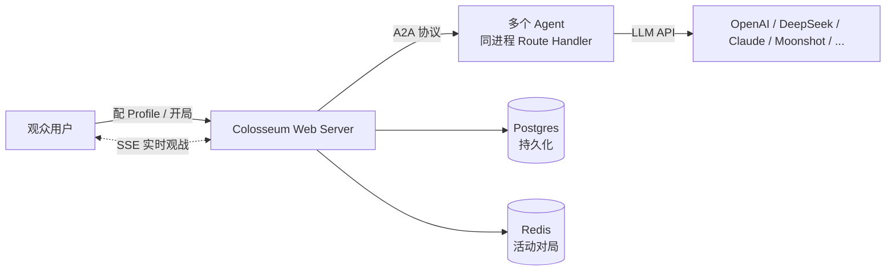

---

## 2. 19 条锁定决策

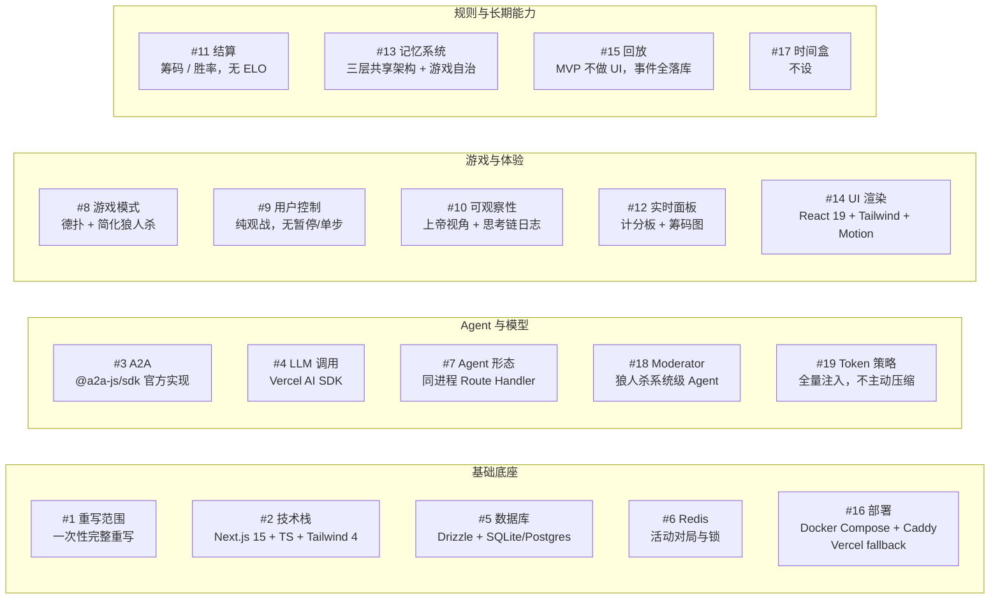

---

## 3. 五层架构

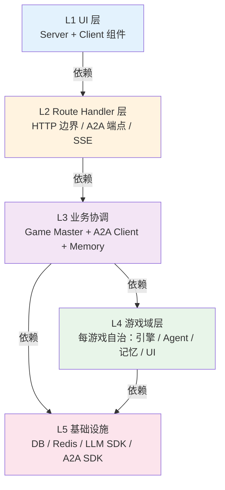

**铁律**：依赖方向严格向下，不允许反向或跨层跳过。以 ESLint import 规则 + CI 强制。

---

## 4. 游戏自治原则

每个游戏拥有完整的一套（禁止跨游戏 if/else 共享）：

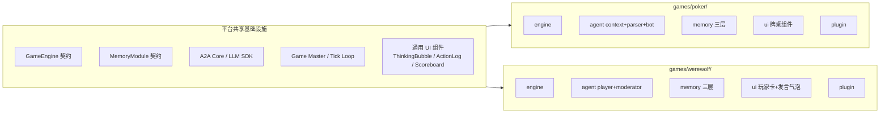

---

## 5. 一手对局的端到端数据流

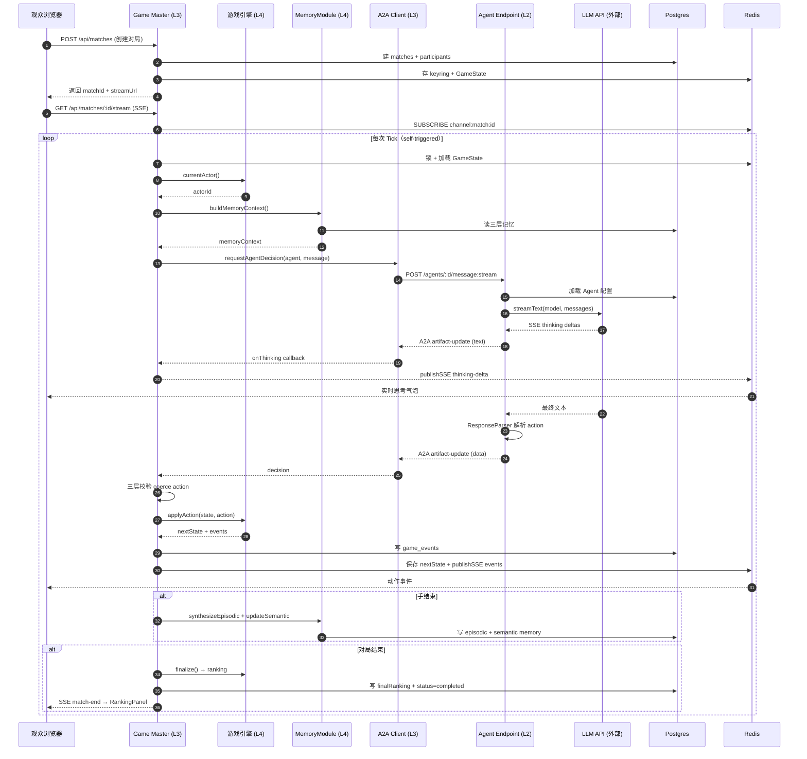

---

## 6. A2A 层三部分

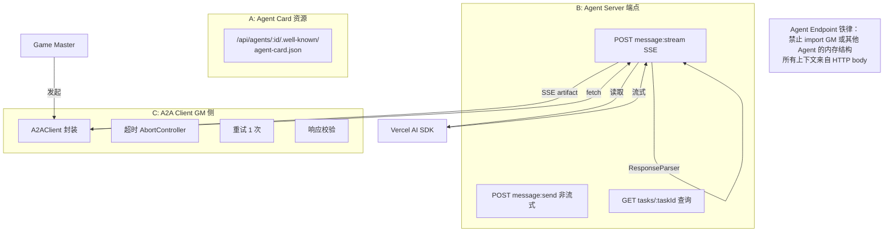

**关键概念分离**：

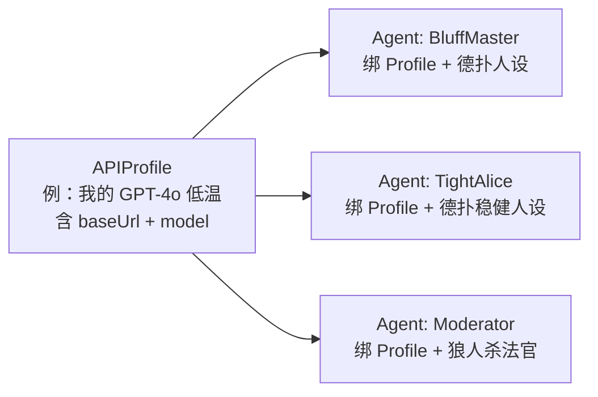

**一个 Profile 可被多个 Agent 共用**。Agent 有 `gameType` 和 `kind (player/moderator)`。

---

## 7. 记忆系统三层

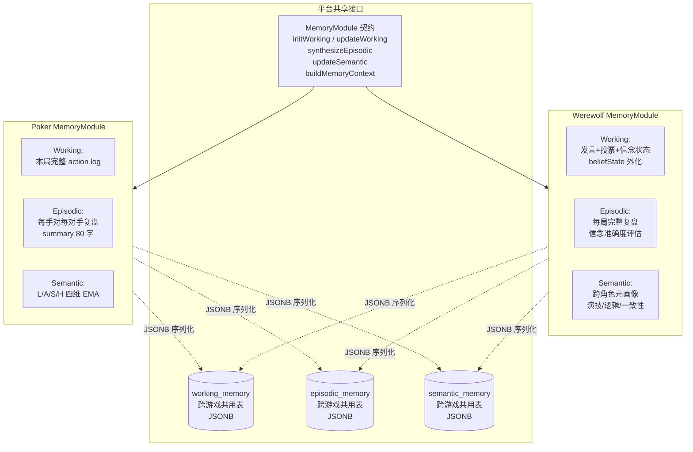

**策略**：全量注入，不做主动压缩；超过模型窗口让 LLM API 原生报错，fallback 到 BotStrategy。

---

## 8. 三层动作校验

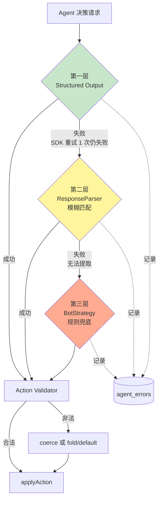

每层失败都写 `agent_errors`。观战页 Badge 显示本局 fallback 次数。

---

## 9. 狼人杀特有：Moderator Agent

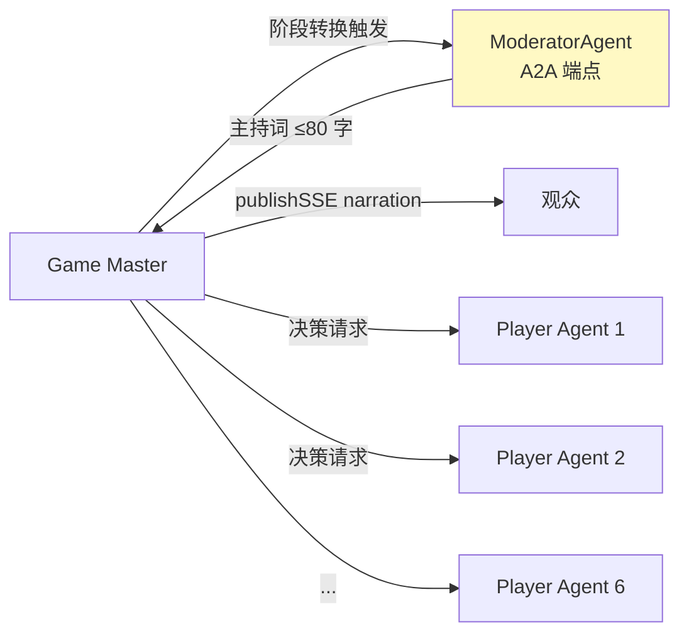

**Moderator 与 Player 走同一套 A2A 路由**（`agentId` 区分）。Moderator 不读 memory，只读最近事件生成旁白。面试话术：多 Agent GroupChat 的 A2A 原生实现。

---

## 10. Match 生命周期状态机

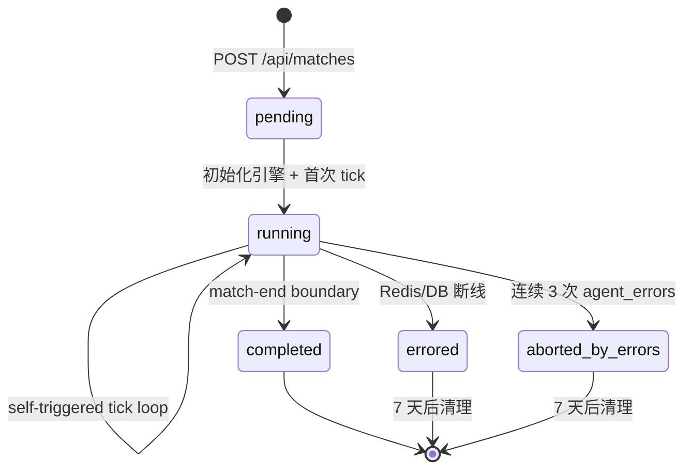

---

## 11. 部署拓扑

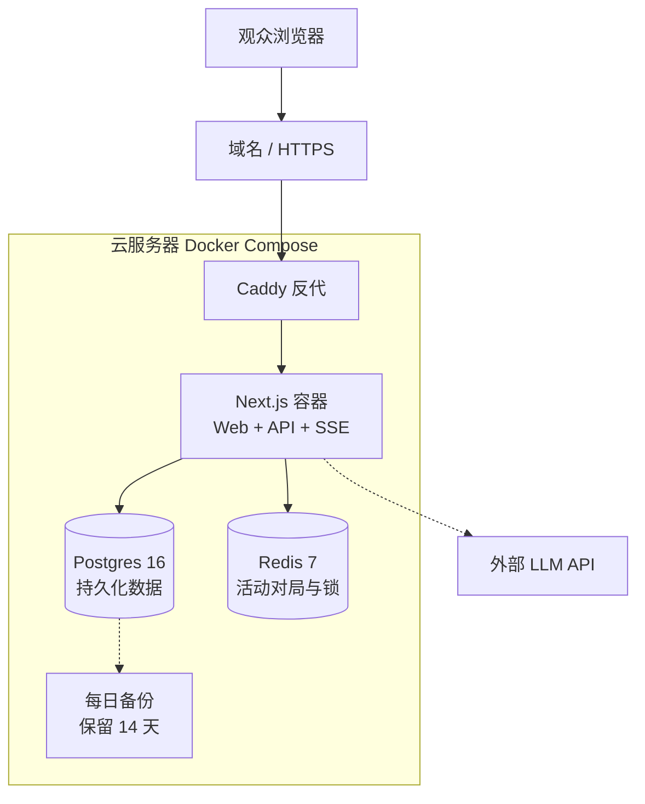

**Fallback 方案**：Vercel + Supabase + Upstash，同一份代码通过环境变量切换。

---

## 12. Phase 实施顺序

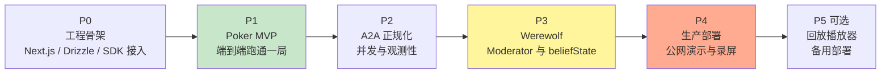

**每 Phase 里程碑**：
- **P0**：Hello World LLM 调通 + A2A toy agent
- **P1**：6 个 LLM 自主打完一局德扑，实时思考链 + 筹码图 + 排名
- **P2**：Agent Card curl 可读 + 2 对局并发不串扰 + fallback Badge
- **P3**：狼人杀 6 玩家 + 1 Moderator 打完一局
- **P4**：公网 URL + 录屏 demo
- **P5**：回放 UI + 备用部署

---

## 13. 风险地图

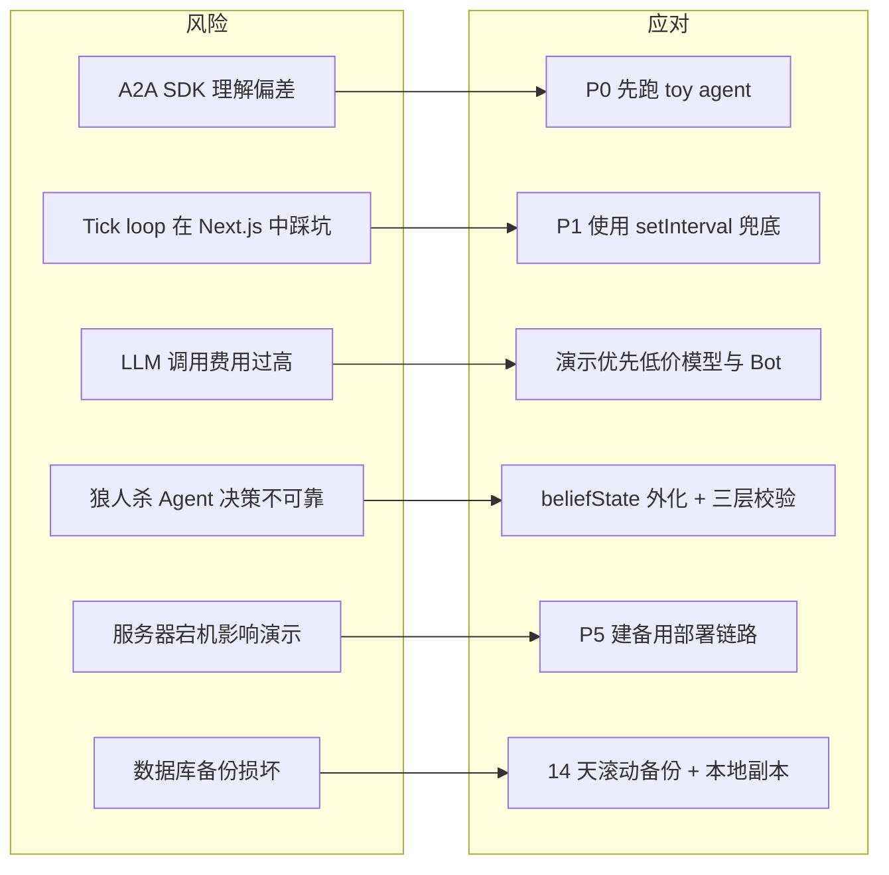

---

## 14. 你现在要决定什么

1. **这份简要设计的骨架和决策，对不对？** 对 → 批准执行仓库迁移 + 进入 writing-plans
2. **某处要改？** 指出具体章节，我改完再 review
3. **完整 spec 里有些细节还想加 mermaid？** 告诉我哪节

---

> 完整技术 spec（含代码示例、DB schema、类型定义）见 `2026-05-06-colosseum-rewrite-design.md`
